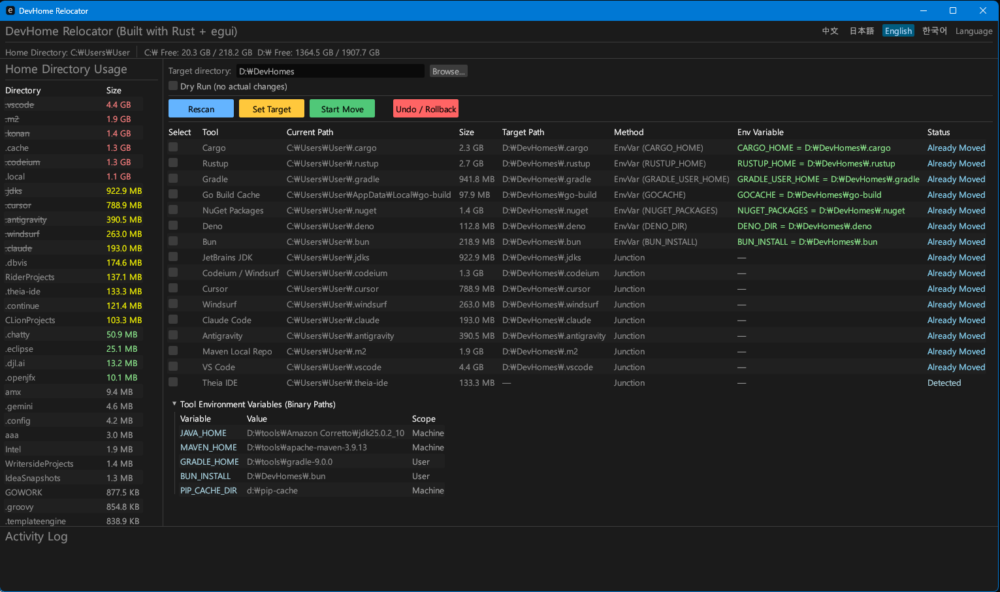

# DevHome Relocator

**시스템 드라이브의 개발 도구 캐시를 다른 드라이브로 이동하여 디스크 공간을 확보하는 Windows GUI 유틸리티**

[English](README.md) | [日本語](README.ja.md) | [中文](README.zh.md)

## 왜 필요한가요?

Cargo, Rustup, Gradle, npm, NuGet, Maven, JetBrains, VS Code 확장 등 수많은 개발 도구는 기본적으로 C: 드라이브의 사용자 프로필 아래에 캐시와 데이터를 저장합니다. 시간이 지나면 이 캐시들은 10GB 이상으로 커지며, 시스템 드라이브의 디스크 공간이 부족해지는 주요 원인이 됩니다.

DevHome Relocator는 이러한 디렉토리를 다른 드라이브(D:, E: 등)로 안전하게 이동하여 시스템 드라이브의 공간을 확보합니다.

## 스크린샷

<!-- 스크린샷을 추가해 주세요 -->


## 이동 방식

DevHome Relocator는 두 가지 방식으로 디렉토리를 이동합니다:

### 1. 환경변수 방식 (EnvVar)

환경변수를 지원하는 도구의 경우, 해당 환경변수를 새 경로로 설정합니다. 도구가 다음 실행 시 자동으로 새 위치를 인식합니다.

예: `CARGO_HOME=D:\DevCache\.cargo`로 설정하면 Cargo가 D: 드라이브를 사용합니다.

### 2. NTFS Junction 방식

환경변수를 지원하지 않는 도구의 경우, NTFS 디렉토리 Junction(심볼릭 링크의 일종)을 생성합니다. 원래 경로에 가상 링크가 생성되므로 도구는 기존 경로를 그대로 사용하면서 실제 데이터는 다른 드라이브에 저장됩니다.

예: `C:\Users\사용자\.jdks` → `D:\DevCache\.jdks` (원래 경로는 Junction으로 대체)

## 지원 대상

### 환경변수 방식

| 대상 | 환경변수 | 기본 위치 |
|------|---------|----------|
| Cargo | `CARGO_HOME` | `%USERPROFILE%\.cargo` |
| Rustup | `RUSTUP_HOME` | `%USERPROFILE%\.rustup` |
| Gradle | `GRADLE_USER_HOME` | `%USERPROFILE%\.gradle` |
| Go Path | `GOPATH` | `%USERPROFILE%\go` |
| Go Build Cache | `GOCACHE` | `%LOCALAPPDATA%\go-build` |
| npm Cache | `NPM_CONFIG_CACHE` | `%APPDATA%\npm-cache` |
| pip Cache | `PIP_CACHE_DIR` | `%LOCALAPPDATA%\pip` |
| NuGet Packages | `NUGET_PACKAGES` | `%USERPROFILE%\.nuget\packages` |
| Deno | `DENO_DIR` | `%LOCALAPPDATA%\deno` |
| pnpm Store | `PNPM_STORE_DIR` | `%LOCALAPPDATA%\pnpm\store` |

### Junction 방식

| 대상 | 기본 위치 |
|------|----------|
| JetBrains JDK | `%USERPROFILE%\.jdks` |
| Codeium/Windsurf | `%USERPROFILE%\.codeium` |
| Cursor | `%USERPROFILE%\.cursor` |
| Windsurf | `%USERPROFILE%\.windsurf` |
| Claude Code | `%USERPROFILE%\.claude` |
| Antigravity | `%USERPROFILE%\.antigravity` |
| Maven Local Repo | `%USERPROFILE%\.m2` |
| VS Code | `%USERPROFILE%\.vscode` |
| Theia IDE | `%USERPROFILE%\.theia-ide` |

## 주요 기능

- **자동 감지**: 시스템에 설치된 개발 도구 디렉토리를 자동으로 스캔하고 크기를 계산
- **이동 상태 감지**: 이미 이동된 디렉토리(AlreadyMoved)를 자동으로 인식
- **재이동 지원**: Junction으로 이동된 디렉토리를 다른 위치로 재이동 가능
- **프로세스 충돌 해결**: 파일 잠금(OS error 32) 발생 시 충돌 프로세스를 감지하고 종료할 수 있는 다이얼로그 제공
- **실시간 진행률**: 바이트 기반의 실시간 ProgressBar로 복사 진행 상황 표시
- **크기 검증**: 복사 완료 후 원본과 대상의 크기를 비교하여 무결성 검증
- **롤백**: 이동을 취소하고 원래 상태로 복원 가능
- **Dry Run**: 실제 이동 없이 시뮬레이션 실행
- **PATH 자동 업데이트**: 이동 시 User PATH의 bin 경로를 자동으로 갱신
- **도구 환경변수 패널**: JAVA_HOME, MAVEN_HOME 등 관련 환경변수 현황 표시
- **다국어 지원**: 한국어, English, 日本語, 中文 (시스템 로케일 자동 감지)

## 빌드 및 실행

```bash
cargo build
cargo run
```

릴리스 빌드:

```bash
cargo build --release
```

## 시스템 요구사항

- **OS**: Windows 10/11
- **파일 시스템**: NTFS (Junction 기능에 필요)
- **빌드 도구**: Rust 2021 Edition
- **최소 해상도**: 1300 x 630

## 기술 스택

- **언어**: Rust (2021 Edition)
- **GUI**: egui / eframe
- **레지스트리**: winreg
- **시스템 정보**: sysinfo
- **파일 탐색**: walkdir
- **파일 다이얼로그**: rfd
- **직렬화**: serde / serde_json
- **로깅**: tracing / tracing-subscriber / tracing-appender

## 로그

로그 파일은 `%LOCALAPPDATA%\DevHomeRelocator\logs` 디렉토리에 일별로 저장됩니다.

## 라이선스

MIT License
